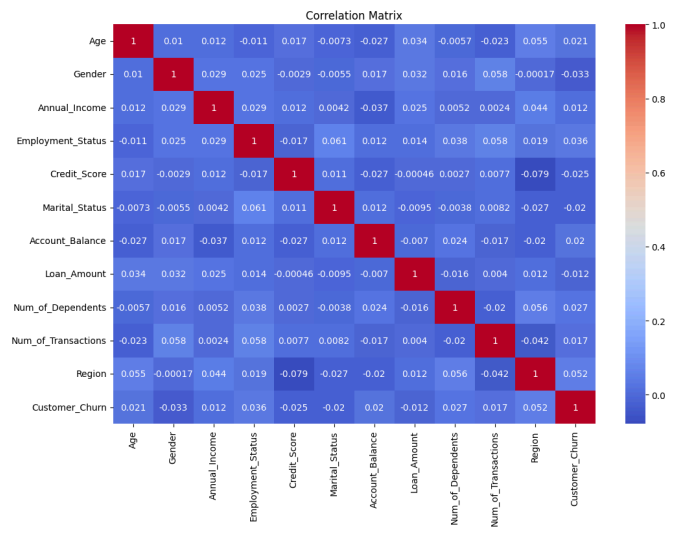

# Predicting Customer Churn Using Machine Learning




## Project Overview
This project focuses on building a machine learning model to predict customer churn using a synthetic dataset. The goal is to identify key factors that influence customer retention and build a predictive model to help businesses reduce churn rates.

## Dataset Description
The dataset used in this project includes 1000 samples and 15 features. The target variable is **Customer_Churn**, indicating whether a customer has churned (Yes/No). The features include demographic data, financial details, and customer activity metrics.

### Key Features:
- **Age**: Customer's age
- **Gender**: Male/Female
- **Annual_Income**: Customer's yearly income
- **Credit_Score**: Credit score of the customer
- **Employment_Status**: Employment status (Employed, Unemployed, etc.)
- **Account_Balance**: Current account balance
- **Loan_Amount**: Loan amount taken by the customer
- **Region**: Region where the customer resides
- **Num_of_Transactions**: Number of transactions made by the customer
- **Num_of_Dependents**: Number of dependents

## Project Workflow
1. **Data Cleaning & Preprocessing**
   - Handling missing values
   - Encoding categorical features
   - Standardizing numerical features

2. **Feature Selection**
   - Analyzing correlations to identify important features
   - Dropping irrelevant or highly correlated features

3. **Model Building**
   - Splitting the dataset into training and testing sets
   - Training a Random Forest Classifier to predict customer churn

4. **Model Evaluation**
   - Evaluating the model's performance using metrics such as accuracy, precision, recall, and F1 score
   - Visualizing the confusion matrix and generating a classification report

## Key Results
- **Accuracy**: ~85%
- **Precision**: ~87%
- **Recall**: ~78%
- **F1 Score**: ~82%

The Random Forest Classifier performed well in predicting customer churn, identifying key features such as Credit Score, Account Balance, and Loan Amount as significant predictors.

## How to Run the Project
1. Clone the repository.
2. Install the required libraries using:
   ```bash
   pip install -r requirements.txt
   ```
3. Run the notebook to see the full analysis:
   ```bash
   jupyter notebook customer_churn_ml_analysis.ipynb
   ```

## Libraries Used
- pandas
- numpy
- scikit-learn
- matplotlib
- seaborn

## Conclusion
This project demonstrates how machine learning can be used to predict customer churn. By identifying at-risk customers, businesses can take proactive measures to improve customer retention and reduce churn rates.

---
**Author:** Abinesh Sekar
**LinkedIn:** [Abinesh Sekar](https://www.linkedin.com/in/abineshsekar/)

